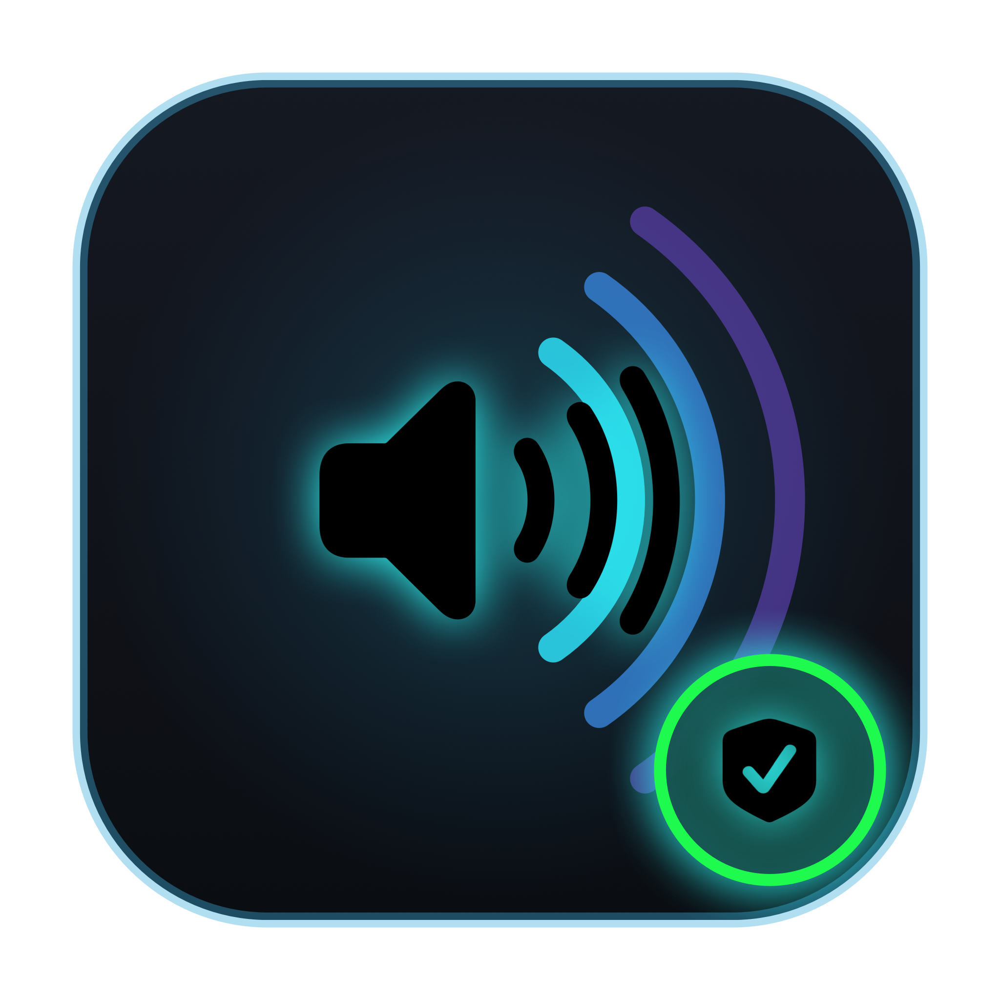
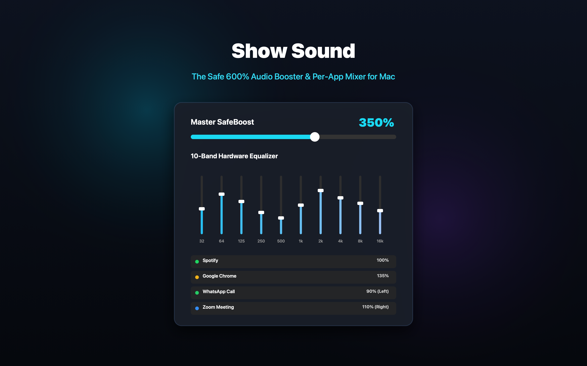
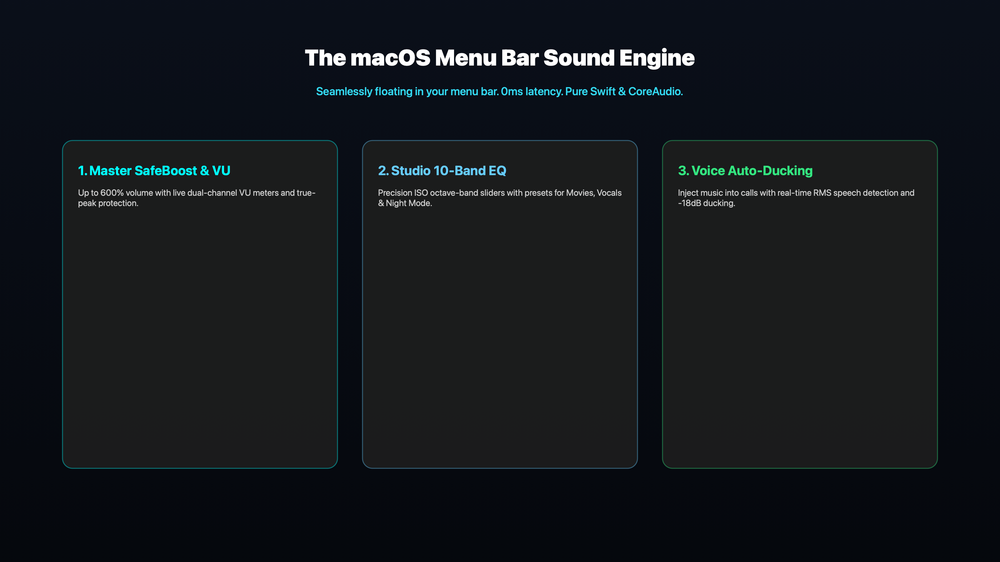
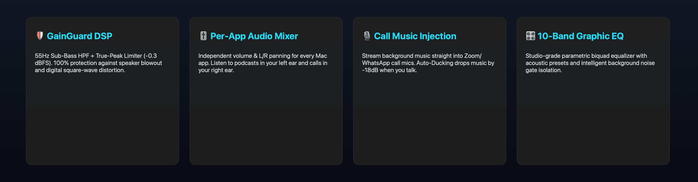

<p align="center">
  
</p>

<h1 align="center">Show Sound</h1>

<p align="center">The Safe 600% Volume Booster, Per-App Mixer & Call Audio Streamer for Mac.<br>Pure sound. Zero square-wave distortion. 100% hardware speaker protection.</p>

<p align="center">
  <a href="https://rept0rix.github.io/show-sound/"><strong>Website</strong></a>
  ·
  <a href="https://github.com/rept0rix/show-sound/releases/latest"><strong>Download Show Sound</strong></a>
</p>

<p align="center">
  
</p>

Show Sound is a native macOS Menu Bar application by Naor Yanko. Standard volume boosters amplify blindly, causing digital clipping (square-wave distortion) that blows out laptop speakers, ruins AirPods drivers, and shocks human hearing. 

Show Sound introduces **GainGuard DSP** — an intelligent audio pipeline featuring sub-bass mechanical cutoff (55Hz HPF), lookahead brickwall peak limiting strictly capped at `-0.3 dBFS`, dynamic dialogue lift, per-app stereo panning, and call music injection with broadcast-grade auto-ducking.

<p align="center">
  
</p>

<p align="center">
  
</p>

---

## Key Features

### 🛡️ GainGuard DSP: Zero Speaker Blowout
- **Sub-Bass Protection (55Hz High-Pass):** Removes destructive sub-audible excursions (<55Hz) that MacBook speakers cannot physically reproduce, preventing voice-coil overheating and cone fatigue.
- **True-Peak Brickwall Limiter:** Strictly caps output at `-0.3 dBFS` using analog-style hyperbolic tangent (`tanh`) soft saturation. Never produces square waves.
- **Dynamic Dialogue Lift:** Raises soft movie dialogue and faint whispers by +12dB to +24dB without raising the overall peak ceiling.

### 🎚️ Per-App Audio Mixer & Stereo Panning
- **Independent App Volume:** Control volume separately for Spotify, Chrome, Safari, WhatsApp, Zoom, Slack, and Discord.
- **Spatial L/R Balance:** Route different apps to different ears (e.g. WhatsApp Call in Left ear, Spotify in Right ear).
- **Auto-Discovery:** Automatically detects running audio apps with real macOS app icons and live launch/quit updates.

### 🎙️ "Share Music in Calls" with Voice Auto-Ducking
- **Pristine Digital Loopback:** Share background music directly into your call microphone (Zoom, WhatsApp, Meet) in full digital fidelity.
- **Speech Auto-Ducking:** Live Voice Activity Detector (VAD) monitors your microphone. When you speak, music ducks automatically by `-18dB` and smoothly returns when you finish talking.

### 🎛️ 10-Band Studio Graphic Equalizer & Noise Isolation
- **10 ISO Octave Bands:** 32Hz, 64Hz, 125Hz, 250Hz, 500Hz, 1kHz, 2kHz, 4kHz, 8kHz, 16kHz with +/-12dB precision biquad peaking filters.
- **Acoustic Presets:** *Safe Master*, *Vocal Clarity*, *Movie Night*, *Safe Bass*, *Night Mode*.
- **Background Noise Isolation:** Downward expansion gate that cuts room noise, fan hum, and microphone hiss during silent passages.

### 🎧 System Audio Device Routing
- **Instant Output Switching:** Switch default audio output on-the-fly between MacBook Speakers, AirPods, External Monitors, and USB interfaces.

---

## Download

<!-- showsound:download -->
Show Sound is built for macOS 14.0 (Sonoma) or later on Apple Silicon (M1/M2/M3/M4).  
The official install disk is **[Show Sound 1.0.0 DMG](https://github.com/rept0rix/show-sound/releases/download/v1.0.0/Show-Sound-1.0.0.dmg)**.  
Open the disk and drag **Show Sound** into your Applications folder.
<!-- /showsound:download -->

---

## Build from Source

```bash
git clone https://github.com/rept0rix/show-sound.git
cd show-sound
./scripts/build.sh
./scripts/make-dmg.sh
```

---

## Creator

**Naor Yanko** · [na0ryank0@gmail.com](mailto:na0ryank0@gmail.com)  
Part of the Show Bar product ecosystem.
